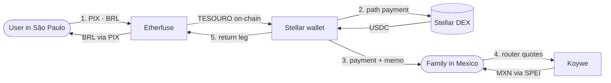
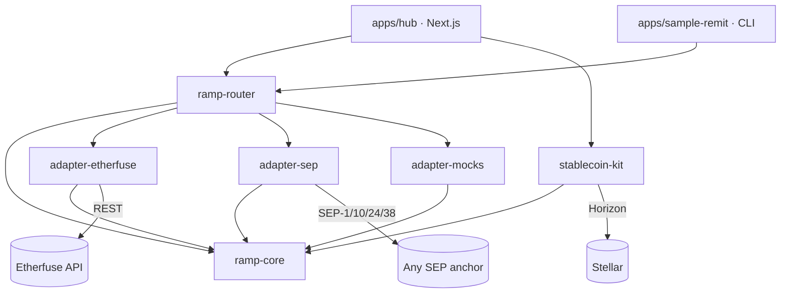

# Brazil Regional Kit

**Fiat on/off-ramps for Brazil and Latin America, on Stellar.**
Take reais on-chain through PIX, move value across the region, and cash out to
local rails — with live quotes from competing anchors at every step.

[Docs](./docs) · Stellar Summit SP 2026 — *Brazil Ramps and Regional Kits*

---

## What this is

Six publishable packages and two apps that use them. The packages are the
deliverable; the apps prove they work.

```
packages/
  ramp-core          The contract every adapter implements. Zero dependencies.
  ramp-router        One API, many anchors. Parallel fan-out, honest ranking.
  adapter-etherfuse  BRL ↔ TESOURO over PIX. Live sandbox or fixture replay.
  adapter-sep        Any SEP-compliant anchor. SEP-1/10/24/38.
  adapter-mocks      Manteca + Koywe, production-shaped, always labelled.
  stablecoin-kit     Wallet, trustlines, DEX swaps, memo-safe payments, x402.

apps/
  hub                The demo — on-ramp, router, corridor, off-ramp, x402.
  sample-remit       A second app that imports the packages. Proof of reuse.
```

## Quickstart

```bash
pnpm install
pnpm dev          # http://localhost:3000
```

**No credentials needed.** With no `.env.local` the Etherfuse adapter replays
recorded fixtures, and the SEP anchor is live regardless — SEP-38 price
endpoints are unauthenticated by design. Everything on-chain is real testnet.

```bash
pnpm sample       # the second app, in your terminal
pnpm test         # unit tests
pnpm lint         # eslint
pnpm format       # prettier
pnpm build        # build every package and the hub
pnpm verify       # format, lint, types, tests + coverage, build, audit
```

Every quality control, and what to do when one fails, is in
[QUALITY.md](./QUALITY.md).

### Walking the full demo without an Etherfuse key

The mock on-ramp replays an anchor conversation; it cannot mint real TESOURO,
because only Etherfuse can. The corridor's DEX swap and the off-ramp both need
the asset to genuinely be in the wallet, so there is one bridge:

```bash
pnpm demo:fund G...YOUR_ADDRESS
```

A disposable testnet account buys TESOURO and USDC on the open order books and
sends them over. No minting and no pretending — the assets are real, the trade
is on-chain, and every downstream step behaves exactly as it will with a live
on-ramp. Connect the wallet and sign the trustline prompts first, or it has
nowhere to deliver.

## Anchor status

The credibility table. Nothing below is dressed up as more than it is, and the
same information is served live from `GET /api/anchors` so the claim on screen
cannot drift from what the code does.

| Anchor | Mode | What is genuinely real |
|---|---|---|
| **Etherfuse** | live sandbox / fixture replay | Quotes, orders, PIX instructions, sandbox settlement hooks. Needs a key from [devnet.etherfuse.com/ramp](https://devnet.etherfuse.com/ramp); without one it replays recorded responses. |
| **SDF Test Anchor** | **live, always** | SEP-1 discovery, SEP-38 quotes, SEP-10 auth, SEP-38 firm quotes, SEP-24 interactive. No credentials required. |
| **Manteca** | simulated | Production-shaped adapter. No self-service sandbox exists; onboarding is commercial. |
| **Koywe** | simulated | Production-shaped adapter. Live in CL/MX/CO/PE, **not yet in Brazil**. |

Always real, in every mode: Stellar accounts, trustlines, balances, DEX order
books, path payments, transaction signing and submission.

## The demo, end to end



1. **On-ramp** — pay a PIX in reais, receive TESOURO on-chain.
2. **Swap** — TESOURO → USDC against the live testnet order books. Atomic: you
   get at least `destMin` or nothing happens.
3. **Send** — one Stellar payment, memo validated against the 28-byte limit.
4. **Payout** — the router prices MXN across every anchor that serves Mexico.
5. **Off-ramp** — sign the return transaction, receive BRL by PIX.

## Architecture



`ramp-core` is shaped after the **SEPs**, not after any one anchor's private
API. That is the load-bearing decision in this repo: because the kit's
vocabulary is the ecosystem standard, adding an anchor costs one adapter, and
adding a SEP-compliant anchor costs almost nothing.

## One API, many anchors

```ts
import { createRampRouter } from '@brk/ramp-router';
import { BRL } from '@brk/ramp-core';

const router = createRampRouter({ adapters: [etherfuse, testanchor, manteca, koywe] });

const result = await router.route({ sellAsset: BRL, sellAmount: '500', country: 'BR' });
```

Or over HTTP, which is what the router page in the hub calls:

```bash
curl "localhost:3000/api/quotes?sell=stellar:USDC:GBBD47IF...&amount=100"
```

```jsonc
{
  "quotes": [ /* ranked, best-per-destination-asset flagged, live ones first */ ],
  "anchors": [ /* EVERY anchor consulted, including failures and why */ ],
  "elapsedMs": 631,
  "hasLiveQuote": true
}
```

Anchors that produced nothing are reported, not hidden. A router that silently
drops anchors is impossible to debug and impossible to trust.

## Things that will bite you

Each of these cost real time, and each is handled in code rather than in a wiki
page nobody reads. Details in [docs/gotchas.md](./docs/gotchas.md).

- **Memos are 28 bytes, not 28 characters.** `"Transferência família"` is 21
  characters and 23 bytes. Over the limit, the payment can land with the memo
  mangled and the anchor never credits the customer. `validateMemo` throws
  rather than truncating; the UI shows a byte counter.
- **Two USDC issuers on testnet, no shared liquidity.** Pick the wrong one and
  you get a market that can never fill. Pinned in `ramp-core`.
- **Etherfuse takes a raw `Authorization` header**, not `Bearer`.
- **`POST /ramp/order` is singular.** The plural form 404s.
- **Passkey wallets expose a `C…` contract address** that looks like an address
  and is silently useless to a classic anchor. Rejected with an explanation.
- **Freighter defaults to mainnet.** The hub shows a banner until you switch.

## Configuration

Everything is optional. See [`.env.example`](./.env.example).

| Variable | Default | Effect |
|---|---|---|
| `RAMP_MODE` | `mock` | Global adapter mode |
| `ETHERFUSE_MODE` | — | Per-adapter override |
| `ETHERFUSE_API_KEY` | — | Without it, Etherfuse degrades to `mock` rather than failing |
| `SEP_ANCHOR_HOME_DOMAIN` | `testanchor.stellar.org` | Any SEP-compliant anchor |
| `SWAP_MODE` | `simulated` | `dex` prefers real order books, falls back automatically |
| `X402_PAY_TO` | issuer (burns) | Where x402 payments are collected |

## Going live with Etherfuse

```bash
pnpm setup:etherfuse    # onboarding URL + the ids to reuse forever
pnpm fixtures:record    # capture real responses so mock mode mirrors the sandbox
```

`setup:etherfuse` refuses to run twice without `--force`. Etherfuse ties orders
to a `customerId`/`bankAccountId` pair, and regenerating them orphans every
order created before.

## Deployment

The hub is a standard Next.js app and deploys anywhere Next runs. See
[docs/deployment.md](./docs/deployment.md) for the Vercel walkthrough and the
environment variables to set.

## Documentation

| | |
|---|---|
| [docs/architecture.md](./docs/architecture.md) | Why the kit is shaped this way |
| [docs/anchors.md](./docs/anchors.md) | Every anchor, what is real, how to add one |
| [docs/protocols.md](./docs/protocols.md) | SEP-1/10/24/38 and x402 as implemented here |
| [docs/gotchas.md](./docs/gotchas.md) | The traps, and where each is handled |
| [docs/deployment.md](./docs/deployment.md) | Deploying the hub |
| [docs/contributing.md](./docs/contributing.md) | Local setup, tests, commit style |
| [QUALITY.md](./QUALITY.md) | Every quality control, how to run it, how to read its failures |
| [AGENTS.md](./AGENTS.md) | Rules for anyone — human or AI — changing this code |

Also: [CONTRIBUTING](./CONTRIBUTING.md) · [Code of conduct](./CODE_OF_CONDUCT.md) ·
[Security](./SECURITY.md) · [Privacy](./PRIVACY.md)

## Licence

MIT.
