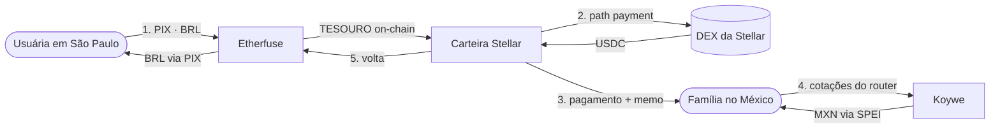
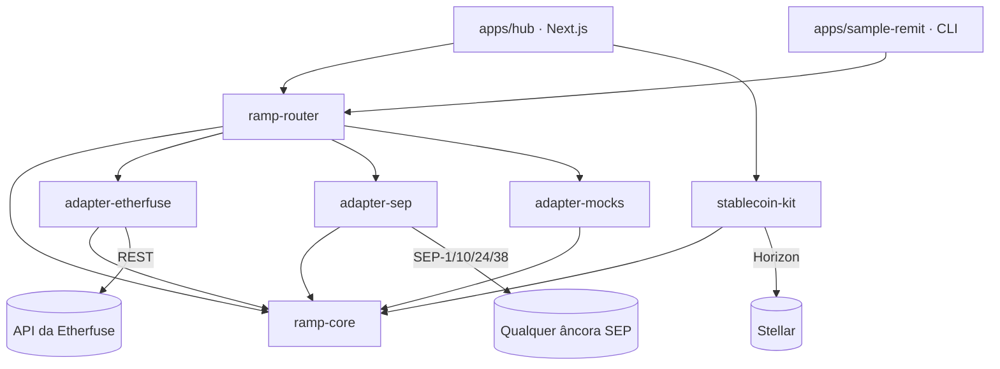

# Brazil Regional Kit

**Rampas de entrada e saída em moeda fiduciária para o Brasil e a América
Latina, na Stellar.**
Coloque reais on-chain via PIX, movimente valor pela região e saque em trilhos
locais — com cotações ao vivo de âncoras concorrentes em cada etapa.

[English](./README.md) · [Documentação](./docs) · Stellar Summit SP 2026 —
*Brazil Ramps and Regional Kits*

---

## O que é isto

Seis pacotes publicáveis e dois aplicativos que os utilizam. Os pacotes são a
entrega; os aplicativos provam que funcionam.

```
packages/
  ramp-core          O contrato que todo adaptador implementa. Zero dependências.
  ramp-router        Uma API, várias âncoras. Fan-out paralelo, ranking honesto.
  adapter-etherfuse  BRL ↔ TESOURO via PIX. Sandbox ao vivo ou replay de fixtures.
  adapter-sep        Qualquer âncora compatível com os SEPs. SEP-1/10/24/38.
  adapter-mocks      Manteca + Koywe, com forma de produção, sempre rotulados.
  stablecoin-kit     Carteira, trustlines, swaps na DEX, pagamentos memo-safe, x402.

apps/
  hub                A demo — on-ramp, router, corredor, off-ramp, x402.
  sample-remit       Um segundo app que importa os pacotes. Prova de reúso.
```

## Início rápido

```bash
pnpm install
pnpm dev          # http://localhost:3000
```

**Nenhuma credencial é necessária.** Sem `.env.local`, o adaptador da Etherfuse
reproduz respostas gravadas, e a âncora SEP fica ao vivo de qualquer forma — os
endpoints de preço do SEP-38 são não autenticados por design. Tudo o que é
on-chain é testnet de verdade.

```bash
pnpm sample       # o segundo app, no seu terminal
pnpm test         # testes unitários
pnpm lint         # eslint + prettier
pnpm build        # compila todos os pacotes e o hub
```

### Percorrer a demo inteira sem uma chave da Etherfuse

O on-ramp simulado reproduz uma conversa com a âncora; ele não consegue emitir
TESOURO de verdade, porque só a Etherfuse pode. O swap na DEX do corredor e o
off-ramp precisam que o ativo esteja genuinamente na carteira, então existe uma
ponte:

```bash
pnpm demo:fund G...SEU_ENDERECO
```

Uma conta descartável de testnet compra TESOURO e USDC nos livros de ofertas
abertos e os envia para você. Sem emissão e sem fingimento — os ativos são
reais, a negociação acontece on-chain, e cada etapa seguinte se comporta
exatamente como se comportará com um on-ramp ao vivo. Conecte a carteira e
assine os prompts de trustline antes, ou não haverá para onde entregar.

## Situação das âncoras

A tabela de credibilidade. Nada abaixo está maquiado como algo mais do que é, e
a mesma informação é servida ao vivo em `GET /api/anchors` — de modo que a
afirmação na tela não pode divergir do que o código realmente faz.

| Âncora | Modo | O que é genuinamente real |
|---|---|---|
| **Etherfuse** | sandbox ao vivo / replay de fixtures | Cotações, ordens, instruções PIX, hooks de liquidação do sandbox. Precisa de uma chave em [devnet.etherfuse.com/ramp](https://devnet.etherfuse.com/ramp); sem ela, reproduz respostas gravadas. |
| **SDF Test Anchor** | **ao vivo, sempre** | Descoberta SEP-1, cotações SEP-38, autenticação SEP-10, cotações firmes SEP-38, SEP-24 interativo. Sem credenciais. |
| **Manteca** | simulada | Adaptador com forma de produção. Não existe sandbox self-service; o onboarding é comercial. |
| **Koywe** | simulada | Adaptador com forma de produção. Ao vivo em CL/MX/CO/PE, **ainda não no Brasil**. |

Sempre reais, em qualquer modo: contas Stellar, trustlines, saldos, livros de
ofertas da DEX, path payments, assinatura e envio de transações.

## A demo, de ponta a ponta



1. **On-ramp** — pague um PIX em reais, receba TESOURO on-chain.
2. **Swap** — TESOURO → USDC contra os livros de ofertas ao vivo da testnet.
   Atômico: você recebe pelo menos `destMin` ou nada acontece.
3. **Envio** — um pagamento Stellar, com o memo validado contra o limite de
   28 bytes.
4. **Saque** — o router precifica MXN em todas as âncoras que atendem o México.
5. **Off-ramp** — assine a transação de volta, receba BRL por PIX.

## Arquitetura



`ramp-core` tem a forma dos **SEPs**, e não da API privada de uma âncora
específica. Essa é a decisão que sustenta o repositório inteiro: como o
vocabulário do kit é o padrão do ecossistema, adicionar uma âncora custa um
adaptador, e adicionar uma âncora compatível com os SEPs custa quase nada.

## Uma API, várias âncoras

```ts
import { createRampRouter } from '@brk/ramp-router';
import { BRL } from '@brk/ramp-core';

const router = createRampRouter({ adapters: [etherfuse, testanchor, manteca, koywe] });

const result = await router.route({ sellAsset: BRL, sellAmount: '500', country: 'BR' });
```

Ou por HTTP, que é o que a página do router no hub chama:

```bash
curl "localhost:3000/api/quotes?sell=stellar:USDC:GBBD47IF...&amount=100"
```

```jsonc
{
  "quotes": [ /* ranqueadas, melhor-por-ativo-de-destino sinalizada, ao vivo primeiro */ ],
  "anchors": [ /* TODAS as âncoras consultadas, incluindo as que falharam e por quê */ ],
  "elapsedMs": 631,
  "hasLiveQuote": true
}
```

Âncoras que não produziram nada são reportadas, não escondidas. Um router que
descarta âncoras em silêncio é impossível de depurar e impossível de confiar.

## Coisas que vão te morder

Cada uma destas custou tempo real, e cada uma é tratada em código em vez de numa
página de wiki que ninguém lê. Detalhes em [docs/gotchas.md](./docs/gotchas.md).

- **Memos têm 28 bytes, não 28 caracteres.** `"Transferência família"` tem 21
  caracteres e 23 bytes. Acima do limite, o pagamento pode chegar com o memo
  truncado e a âncora nunca credita o cliente. `validateMemo` lança erro em vez
  de truncar; a interface mostra um contador de bytes.
- **Dois emissores de USDC na testnet, sem liquidez compartilhada.** Escolha o
  errado e você terá um mercado que nunca preenche. Fixado em `ramp-core`.
- **A Etherfuse aceita um header `Authorization` cru**, sem `Bearer`.
- **`POST /ramp/order` é singular.** A forma plural retorna 404.
- **Carteiras com passkey expõem um endereço `C…`** que parece um endereço e é
  silenciosamente inútil para uma âncora clássica. Rejeitado com explicação.
- **A Freighter começa na mainnet.** O hub mostra um aviso até você trocar.

## Configuração

Tudo é opcional. Veja [`.env.example`](./.env.example).

| Variável | Padrão | Efeito |
|---|---|---|
| `RAMP_MODE` | `mock` | Modo global dos adaptadores |
| `ETHERFUSE_MODE` | — | Override por adaptador |
| `ETHERFUSE_API_KEY` | — | Sem ela, a Etherfuse cai para `mock` em vez de falhar |
| `SEP_ANCHOR_HOME_DOMAIN` | `testanchor.stellar.org` | Qualquer âncora compatível com os SEPs |
| `SWAP_MODE` | `simulated` | `dex` prefere livros de ofertas reais, com fallback automático |
| `X402_PAY_TO` | emissor (queima) | Onde os pagamentos x402 são recolhidos |

## Indo ao vivo com a Etherfuse

```bash
pnpm setup:etherfuse    # URL de onboarding + os ids para reusar para sempre
pnpm fixtures:record    # captura respostas reais para o modo mock espelhar o sandbox
```

`setup:etherfuse` se recusa a rodar duas vezes sem `--force`. A Etherfuse
vincula ordens a um par `customerId`/`bankAccountId`, e regenerá-los órfã toda
ordem criada antes.

## Deploy

O hub é um app Next.js padrão e roda em qualquer lugar onde o Next roda. Veja
[docs/deployment.md](./docs/deployment.md) para o passo a passo na Vercel e as
variáveis de ambiente a definir.

## Documentação

| | |
|---|---|
| [docs/architecture.md](./docs/architecture.md) | Por que o kit tem essa forma |
| [docs/anchors.md](./docs/anchors.md) | Cada âncora, o que é real, como adicionar uma |
| [docs/protocols.md](./docs/protocols.md) | SEP-1/10/24/38 e x402 como implementados aqui |
| [docs/gotchas.md](./docs/gotchas.md) | As armadilhas, e onde cada uma é tratada |
| [docs/deployment.md](./docs/deployment.md) | Fazendo deploy do hub |
| [docs/contributing.md](./docs/contributing.md) | Setup local, testes, estilo de commit |

Também: [CONTRIBUTING](./CONTRIBUTING.md) ·
[Código de conduta](./CODE_OF_CONDUCT.md) · [Segurança](./SECURITY.md) ·
[Privacidade](./PRIVACY.md)

## Licença

MIT.
