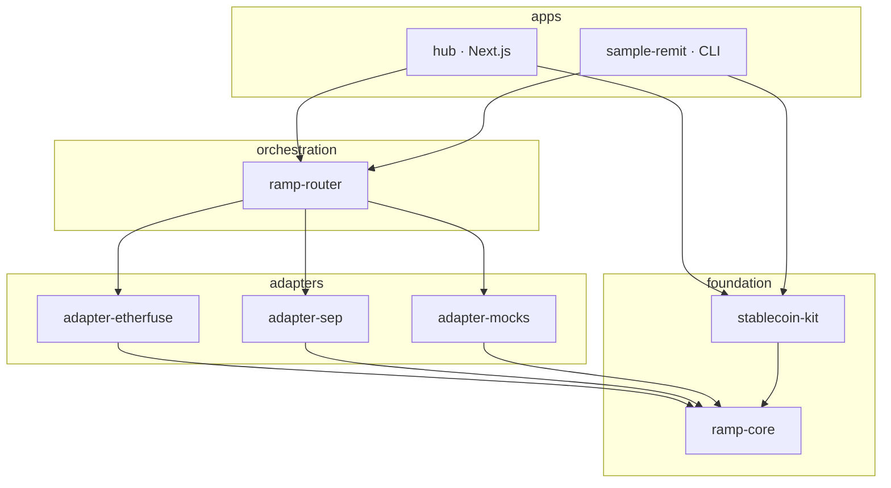

# Architecture

## The decision everything else follows from

`ramp-core` is shaped after the **Stellar Ecosystem Proposals**, not after any
one anchor's private API.

That sounds like a style choice and it is not. Etherfuse speaks its own dialect:
assets are `BRL` and `TESOURO:GC3C…`, statuses are `SHOUTING_SNAKE_CASE`, the
auth header takes a raw key, and the order endpoint is singular. If the kit's
own vocabulary had grown out of that first integration, every subsequent anchor
would have meant translating one private dialect into another, and the second
integration would have cost as much as the first.

Instead the kit's vocabulary is SEP-38 for quotes and SEP-24/6 for orders. The
consequences:

- Adding a bespoke anchor costs **one adapter** — a translation layer at the
  edge, and nothing above it changes.
- Adding a SEP-compliant anchor costs **almost nothing** — `adapter-sep` already
  speaks the protocol, so it is a home domain in an env var.
- The router can rank an Etherfuse quote against a SEP-38 quote because they
  arrive as the same shape.

## Layers



Dependencies point one way. `ramp-core` depends on nothing at all — not on
Horizon, not on the Stellar SDK, not on a HTTP client. That is what lets an
adapter for a new anchor be written and tested without pulling in a chain
connection.

| Package | Depends on | Why it exists |
|---|---|---|
| `ramp-core` | — | Types, errors, asset ids, money maths, memo safety |
| `adapter-etherfuse` | `ramp-core` | One company's REST API, translated |
| `adapter-sep` | `ramp-core`, stellar-sdk¹ | The ecosystem protocol, for any anchor |
| `adapter-mocks` | `ramp-core` | Anchors we cannot call yet, honestly modelled |
| `ramp-router` | `ramp-core` | Fan-out, ranking, failure reporting |
| `stablecoin-kit` | `ramp-core`, stellar-sdk¹ | Everything on-chain |

¹ peer dependency — the host app owns the SDK version.

## Where the seams are

**`RampAdapter` is the only interface the router knows.** It never imports a
concrete adapter. Register whatever you like:

```ts
createRampRouter({ adapters: [etherfuse, testanchor, manteca, koywe, yours] });
```

**Adapters are built by factories, not constructed as singletons.** Mode and
credentials are injected, so the same class is a live client or a fixture
replayer depending on what it was handed. Mock mode is not a parallel
implementation that can drift out of sync — it is the same adapter over a
different transport.

**Chain access is separate from anchor access.** `stablecoin-kit` knows about
Horizon and knows nothing about anchors; adapters know about anchors and nothing
about Horizon. The one place they meet is `resolveReturnTransaction`, which
takes an `Order` and produces an unsigned transaction — and that lives in
`stablecoin-kit` because building transactions is its job.

## Live vs mock

Mode resolves per adapter: explicit argument → adapter env var → global env var
→ default. The default is `mock`.

That default is deliberate. A judge who clones this repo with no credentials
gets a working demo on the first `pnpm dev`, and our own demo is never one flaky
sandbox away from having nothing to show. The Etherfuse sandbox is documented by
its own ecosystem as "rough around the edges"; building against it directly
would have meant a demo that fails in front of an audience for reasons that have
nothing to do with the code.

What mock mode does **not** do is fake the chain. Accounts, trustlines,
balances, order books, path payments and signatures are real testnet in every
mode. Only the anchor conversation is replayed.

Every quote, order and swap carries its mode all the way to a badge in the UI.

## Request flow

A quote through the router:

```
GET /api/quotes?sell=iso4217:BRL&amount=500&country=BR
  │
  ├─ readyAnchors()            wait for SEP discovery (once, cached)
  ├─ router.route()
  │    ├─ candidates()         which adapters serve this corridor?
  │    ├─ Promise.allSettled   every (adapter, destination) pair in parallel
  │    │    ├─ etherfuse.getQuote()  → REST or fixture
  │    │    └─ manteca.getQuote()    → fixture
  │    └─ rank()               group by destination asset, order by payout
  └─ publicQuote()             strip `raw` before it crosses the wire
```

Two things worth noticing. Each adapter has its own deadline, so a hung anchor
costs its timeout rather than the whole response. And failures are collected
into `result.anchors` rather than thrown — a router that silently drops anchors
cannot be debugged.

## State

There is no database.

- **Anchor adapters** are singletons on `globalThis`, because Etherfuse quote
  context and the mock order store must survive between API requests — and
  surviving Next's hot reload is the point, otherwise editing a component
  mid-demo would drop every in-flight order. The cache key is versioned so a
  shape change rebuilds instead of blowing up on a stale object.
- **The browser** keeps locale and the connected address in `localStorage`.
- **Order state** lives with the anchor and is polled.

## Security boundaries

- `apps/hub/src/lib/anchors.ts` and `lib/sep.ts` are marked `server-only`. The
  Etherfuse API key is read there and never reaches the browser.
- `RampError.toJSON()` omits the raw anchor payload, which can hold customer
  data. API routes return only code, message and a retryable flag.
- SEP-10 challenges are verified **on the server, before** they are handed to a
  wallet — see [protocols.md](./protocols.md).
- x402 payments are verified against Horizon and marked spent, so one payment
  buys exactly one request.
